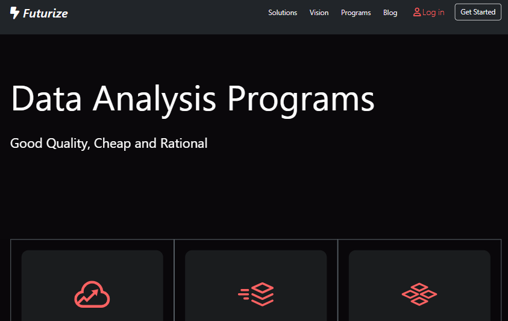
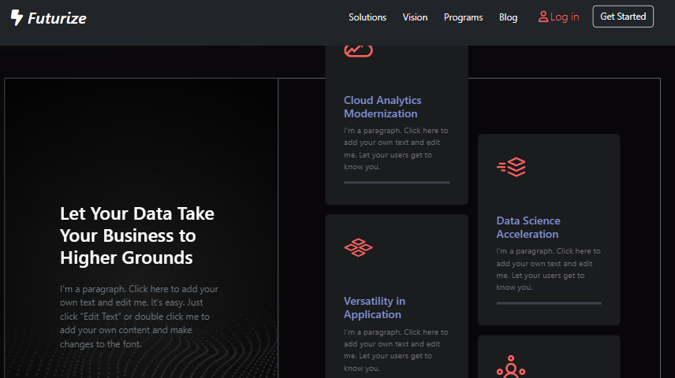
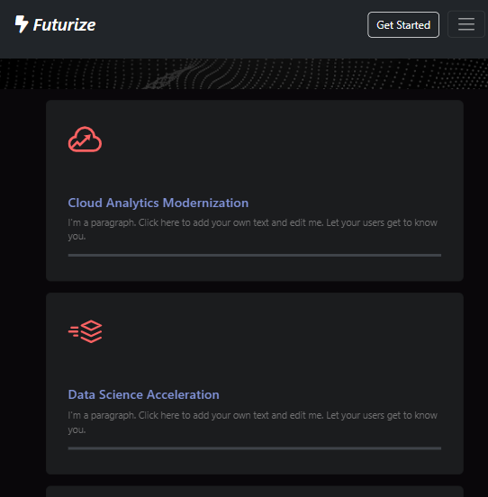
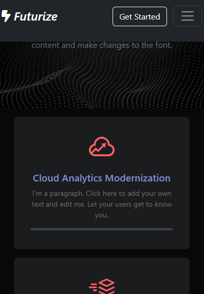
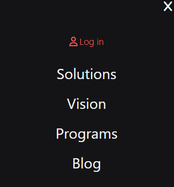

# Building a Responsive Tech website: Futurize :fire:
*Started: 07/03/2023 - 17/03/2023 and 5 minutes to read*
:star: This is a project that I made to practice and apply bootstrap in building responsive website. Cloning from a pattern which was on wix.com combining with some ideas of myself. The project uses Bootstrap as CSS framework, with a little basic javascript. Check the website at this [link](https://jessecn1024.github.io/TechPage/).
***

## Features in the Project
#### 1. Hover animation for navbar links
Use `nav-links:hover::a`fter{}`

#### 2. Multiple WebPages
* **Main page**

* **Programs Page**

#### 3. Repsonsive website 
All webpages are responsive, stretch properly on multiple resolutions
* **PC** <br>

* **Tablet** <br>

* **Mobile** <br>

#### 4. Toggle bar on resolutions smaller than Tablet's

**--->**

#### 5. Reveal elemment on scrolling
The animation of elements on webpage will be played when you first scroll down


## Note-Taking Section
*- for my study throughtout this project*
1. **Easy modal js**: 
   1. Add attribute for open/close btn: `onclick="show/closeMenu"`
   2. Add the following js
   ```js
   var el1 = document.GetElementById("");
   function showMenu(){
      el1.style.display="block";
   }
   ```
2. **height:100%** doesn't work in cols -> **the parents tag must have a declared height**
3. To create a class for **col-2-4** in the @media:
   ```css
      .col-lg-2-4 {
         flex: 0 0 auto;
         width: 20%;
      }
   ```
4. Responsive written alongside boostrap: 
   ```css
      /* Mobile and Table  t */
   @media (max-width: 991px){}
   /* Mobile */
   @media (max-width: 767px){}
   /* Tablet */
   @media (min-width: 768px) and (max-width: 991px){}
   /* PC and low resolution PC */
   @media (min-width: 992px){}
   /* Low resolution PC */
   @media (min-width: 992px) and (max-width: 1199px){}
   /* Tablet and PC */
   @media (min-width: 768px){}
   ```
5. A good background traslucent film: 
   `background-image: line-gradient(rgba(4,9,30,.7), rgba(4,9,30,.7)), url("link")`
6. **!!  Reveal on Scrolling !!** 
   1. Add class `.reveal` to els: `animation-play-state: paused;` and create class `.reveal.active{}` with `animation-play-state: running;`
   2. Add the following javascript
   ```js
   // Review on Scroll
         window.addEventListener('scroll', reveal);
         // Every time scrolling, the funcion will be triggered
         function reveal(){
               // Call varibles on of the scrolling animation els
               var reveals = document.querySelectorAll('.reveal');
               // Call each of them
               for (var i=0; i<reveals.length; i++){
                  var windowHeight = window.innerHeight;
                  var revealtop = reveals[i].getBoundingClientRect().top;
                  var revealpoint = 10; /*The less the value is, the faster it will play when scrolling down*/
                  // The top of the reveal lies below the (fullpageheight - revealpoint)
                  if (revealtop < windowHeight - revealpoint){
                     reveals[i].classList.add('active');
                  }
                  else{
                     // In case you want to make the animation replay after scroll it again
                     // reveals[i].classList.remove('active');
                  }
               }
         }
   ```


